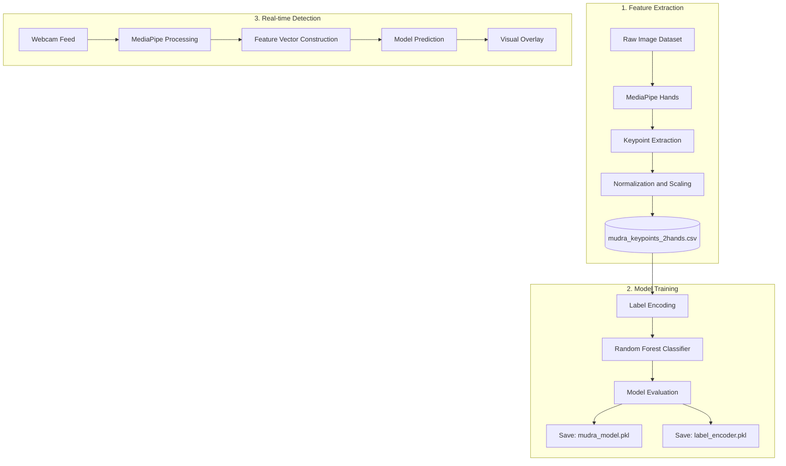
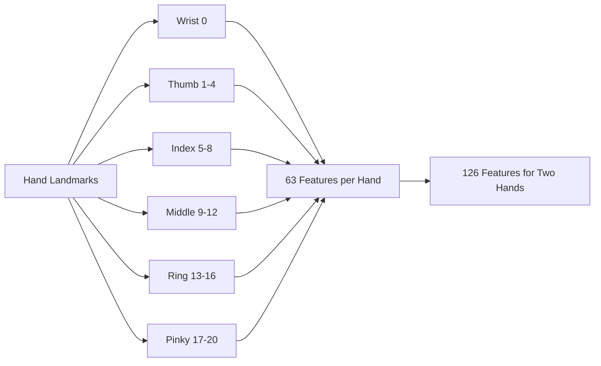

# System Architecture & Technical Working

This project implements an AI-based Bharatanatyam mudra detection system. It uses computer vision for hand landmark extraction and machine learning for classification. The system supports both single-hand (Asamyuta) and two-hand (Samyuta) mudras.

## 1. Three-Phase Pipeline

1) Feature Extraction (`create_data.py`)
- Uses MediaPipe Hands to detect 21 hand landmarks per hand (x, y, z).
- Normalizes coordinates for translation and scale invariance.
- Writes a fixed-length feature vector to `mudra_keypoints_2hands.csv`.

2) Model Training (`train.py`)
- Encodes labels and trains a Random Forest classifier.
- Produces `mudra_model.pkl` and `label_encoder.pkl`.

3) Real-time Inference (`live.py`)
- Runs webcam capture and MediaPipe detection.
- Builds the same feature vector format as training.
- Predicts the mudra and overlays the result on the live feed.



## 2. Feature Engineering (create_data.py)

MediaPipe provides 21 landmarks per hand with (x, y, z) coordinates. The system normalizes the landmarks to reduce the effect of camera distance and hand position.

Normalization logic:
- Translation: Landmark 0 (Wrist) becomes the origin.
- Scaling: Distance from Landmark 0 (Wrist) to Landmark 9 (Middle MCP) is the scale factor.

For each landmark $LM_i$:

$$
\text{scale} = \lVert LM_9 - LM_0 \rVert
$$

$$
f_i = \frac{LM_i - LM_0}{\text{scale}}
$$

Multi-hand handling:
- Each hand has 63 features (21 landmarks x 3 coordinates).
- Feature vector format: [Left Hand (63)] + [Right Hand (63)].
- If a hand is missing, its 63 values are padded with zeros.

## 3. Model Training (train.py)

The training phase learns a mapping from normalized keypoints to mudra labels.

Key design choices:
- Random Forest Classifier: handles non-linear patterns and works well with tabular features.
- Label encoding: converts mudra names into numeric classes.
- Consistent input size: supports both one-hand and two-hand mudras without model changes.

Artifacts:
- `mudra_model.pkl`: trained classifier.
- `label_encoder.pkl`: class mapping.

## 4. Real-time Inference (live.py)

The live pipeline mirrors the training feature construction:
- Capture frames via OpenCV.
- Run MediaPipe to get landmarks.
- Normalize and build the 126-length feature vector.
- Predict and display the mudra label with a confidence score.

## 5. Dataset Layout (Required)

Ensure the dataset is structured with one subfolder per mudra class:

```
Bharatanatyam-Mudra-Dataset/
  Alapadma/
  Pataka/
  ...
```

Each folder should contain images of that mudra.

## 6. System Requirements

- Python 3.8+
- mediapipe
- opencv-python
- scikit-learn
- pandas
- joblib

## 7. Workflow Summary

1) Run `create_data.py` to generate `mudra_keypoints_2hands.csv`.
2) Run `train.py` to create `mudra_model.pkl` and `label_encoder.pkl`.
3) Run `live.py` for real-time testing.

## 8. Hand Feature Map (Conceptual)



## 9. Extensibility

This modular design makes it easy to:
- Add new mudras by placing new images in the dataset folders.
- Swap the Random Forest for a deep learning model while keeping the same feature pipeline.
- Extend to more hands or new sensors by adjusting feature construction.
